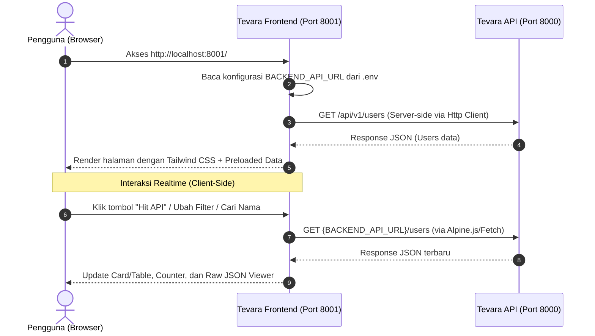

# Tevara - Frontend Web Client (User Management)

Web client modern berbasis **Laravel**, **Tailwind CSS v4**, dan **Alpine.js** yang mengonsumsi REST API dari backend (`tevara-api`) secara dinamis melalui konfigurasi environment.

---

## Daftar Isi
- [Gambaran Proyek](#gambaran-proyek)
- [Alur Kerja Sistem (Workflow)](#alur-kerja-sistem-workflow)
- [Struktur Proyek](#struktur-proyek)
- [Spesifikasi API Endpoint](#spesifikasi-api-endpoint)
- [Prasyarat Sistem](#prasyarat-sistem)
- [Panduan Instalasi & Menjalankan](#panduan-instalasi--menjalankan)
  - [1. Clone Repository](#1-clone-repository)
  - [2. Install Dependensi PHP (Composer)](#2-install-dependensi-php-composer)
  - [3. Install Dependensi Frontend (NPM)](#3-install-dependensi-frontend-npm)
  - [4. Konfigurasi Environment (.env)](#4-konfigurasi-environment-env)
  - [5. Generate Application Key](#5-generate-application-key)
  - [6. Menjalankan Server](#6-menjalankan-server)
- [Fitur Halaman Utama](#fitur-halaman-utama)
- [Troubleshooting & Solusi](#troubleshooting--solusi)

---

## Gambaran Proyek

Proyek ini merupakan sisi client/frontend dari sistem PBL Tevara. Halaman utama dirancang untuk melakukan request **GET** ke endpoint `/users` pada server backend API dan menampilkan data pengguna dalam antarmuka Tailwind CSS yang modern, responsif, dan interaktif.

### Teknologi yang Digunakan:
- **Backend/Framework:** Laravel 12 (PHP 8.2+)
- **Styling:** Tailwind CSS v4 via `@tailwindcss/vite`
- **Interaktivitas Frontend:** Alpine.js v3 & Axios / Native Fetch
- **Build Tool:** Vite 7

---

## Alur Kerja Sistem (Workflow)



### Penjelasan Alur:
1. **Konfigurasi URL:** URL dasar backend ditentukan pada file `.env` melalui variabel `BACKEND_API_URL`. Nilai ini didaftarkan di `config/services.php` pada key `backend_api.url`.
2. **Server-Side Rendering (SSR):** Pada file `routes/web.php`, Laravel mengambil URL lengkap `{BACKEND_API_URL}/users` menggunakan HTTP Client (`Http::get()`) untuk memuat data awal tanpa jeda render.
3. **Client-Side Re-fetching:** Halaman Blade (`resources/views/welcome.blade.php`) menggunakan Alpine.js untuk mendukung pengambilan data live (`Hit API`), pencarian instan, filter per role (`Admin` / `Member`), alih tampilan (Tabel vs Card), serta drawer inspeksi raw JSON.

---

## Struktur Proyek

Berikut adalah file-file penting yang menyusun fungsionalitas aplikasi ini:

```text
tevara/
├── app/                        # Logika aplikasi Laravel
├── config/
│   └── services.php            # Mendaftarkan konfigurasi 'backend_api.url' dari .env
├── resources/
│   ├── css/
│   │   └── app.css             # Konfigurasi Tailwind CSS v4 (@import 'tailwindcss')
│   ├── js/
│   │   ├── app.js              # Inisialisasi Alpine.js & Bootstrap
│   │   └── bootstrap.js        # Konfigurasi Axios & HTTP headers
│   └── views/
│       └── welcome.blade.php   # Tampilan utama (UI Tailwind CSS + Alpine component)
├── routes/
│   └── web.php                 # Route '/' yang memanggil API {BACKEND_API_URL}/users
├── .env                        # Konfigurasi lokal (berisi BACKEND_API_URL)
├── .env.example                # Template konfigurasi environment
├── composer.json               # Dependensi PHP & Laravel
├── package.json                # Dependensi JavaScript, Tailwind CSS & Vite
└── vite.config.js              # Konfigurasi Vite & Tailwind plugin
```

---

## Spesifikasi API Endpoint

Halaman utama mengonsumsi API pengguna dengan format sebagai berikut:

- **Method:** `GET`
- **URL Target:** `{BACKEND_API_URL}/users` (Contoh: `http://127.0.0.1:8000/api/v1/users`)
- **Headers:**
  - `Accept: application/json`

### Contoh Format Response (JSON):
```json
{
  "success": true,
  "message": "Users retrieved successfully",
  "data": [
    {
      "id": 1,
      "name": "John Doe",
      "email": "john@example.com",
      "role": "admin"
    },
    {
      "id": 2,
      "name": "Jane Smith",
      "email": "jane@example.com",
      "role": "member"
    }
  ]
}
```

---

## Prasyarat Sistem

Sebelum memulai instalasi, pastikan perangkat Anda telah terpasang:
- **PHP** minimal versi 8.2 (dengan ekstensi `curl`, `mbstring`, `openssl`, `pdo`, `sqlite3` aktif)
- **Composer** versi 2.x
- **Node.js** versi 18.x atau lebih baru
- **NPM** atau package manager yang setara
- Server **Backend API (`tevara-api`)** sudah terkonfigurasi dan berjalan (default di port `8000`)

---

## Panduan Instalasi & Menjalankan

Ikuti langkah-langkah di bawah ini secara berurutan untuk menjalankan proyek dari awal:

### 1. Clone Repository
Buka terminal Anda dan clone repositori proyek:
```bash
git clone <URL_REPOSITORY_ANDA> tevara
cd tevara
```

### 2. Install Dependensi PHP (Composer)
Jalankan composer untuk mengunduh vendor Laravel:
```bash
composer install
```

### 3. Install Dependensi Frontend (NPM)
Install dependensi JavaScript, Tailwind CSS, dan Vite:
```bash
npm install
```

### 4. Konfigurasi Environment (`.env`)
Salin file konfigurasi `.env.example` menjadi `.env`:

**Windows (PowerShell):**
```powershell
Copy-Item .env.example .env
```

**Linux / macOS / Git Bash:**
```bash
cp .env.example .env
```

Buka file `.env` dan pastikan konfigurasi URL backend sesuai dengan alamat server backend API Anda:
```dotenv
APP_NAME=Tevara
APP_ENV=local
APP_KEY=
APP_DEBUG=true
APP_URL=http://localhost:8001

# URL Endpoint Backend API (tevara-api)
BACKEND_API_URL=http://127.0.0.1:8000/api/v1
```

> **Catatan Penting:** Endpoint `/users` akan otomatis digabungkan dengan `BACKEND_API_URL`, sehingga menghasilkan alamat request: `http://127.0.0.1:8000/api/v1/users`.

### 5. Generate Application Key
Jalankan perintah berikut untuk mengenerate encryption key Laravel:
```bash
php artisan key:generate
```

---

### 6. Menjalankan Server

Untuk dapat melihat dan menggunakan aplikasi secara penuh, Anda membutuhkan **3 proses/terminal** yang berjalan:

#### Terminal 1: Jalankan Backend API (`tevara-api`)
Masuk ke direktori backend API Anda dan jalankan server pada port `8000`:
```bash
cd "path/to/tevara-api"
php artisan serve --port=8000
```
> Pastikan backend dapat diakses di `http://127.0.0.1:8000/api/v1/users`.

#### Terminal 2: Jalankan Vite Dev Server (Frontend Assets)
Di dalam direktori `tevara`, jalankan Vite untuk mengompilasi CSS dan JS:
```bash
npm run dev
```

#### Terminal 3: Jalankan Laravel Web Server (Frontend)
Di dalam direktori `tevara`, jalankan Laravel di port `8001`:
```bash
php artisan serve --port=8001
```

#### Buka di Browser:
Buka web browser Anda dan akses:
👉 **[http://localhost:8001](http://localhost:8001)**

---

## Fitur Halaman Utama

1. **Badge Endpoint Aktif:** Menampilkan method `GET` dan URL aktif yang diambil langsung dari `.env` (`BACKEND_API_URL`).
2. **Tombol "Hit API":** Mengambil ulang data secara real-time dari backend API dengan indikator loading animasi.
3. **Statistik Pengguna:**
   - Total Users terdaftar
   - Jumlah Administrator (`role: admin`)
   - Jumlah Anggota (`role: member`)
   - Pesan status dari response API
4. **Pencarian & Filter Interaktif:**
   - Kolom pencarian instan (berdasarkan ID, Nama, atau Email)
   - Tab filter Role (`Semua`, `Admin`, `Member`)
5. **Dua Mode Tampilan (Switcher):**
   - **Tampilan Tabel:** Format tabel dengan avatar inisial, email link, badge role, dan status.
   - **Tampilan Card Grid:** Kartu profil modern dengan gradien dan efek hover.
6. **Drawer Raw JSON Response:**
   - Menampilkan payload JSON asli dari API sesuai format spesifikasi.
   - Tombol **"Copy JSON"** dengan konfirmasi tooltip instan untuk kemudahan debugging.
7. **Pencegahan & Penanganan Error:**
   - Menampilkan banner peringatan ramah jika server backend sedang mati atau tidak dapat dijangkau, disertai tombol *Coba Lagi*.

---

## Troubleshooting & Solusi

### 1. Pesan "Gagal Mengambil Data Pengguna" atau Error Connection
- **Penyebab:** Server backend di port `8000` belum berjalan atau URL di file `.env` salah.
- **Solusi:** 
  1. Pastikan `php artisan serve --port=8000` di folder `tevara-api` aktif.
  2. Buka URL `http://127.0.0.1:8000/api/v1/users` langsung di browser/Postman untuk memastikan API merespons.
  3. Periksa file `.env` di baris `BACKEND_API_URL=http://127.0.0.1:8000/api/v1`.

### 2. Tampilan Tidak Memiliki Gaya (Styling Rusak / Tailwind Tidak Muncul)
- **Penyebab:** Vite server belum berjalan atau belum di-build.
- **Solusi:**
  - Jalankan `npm run dev` pada terminal terpisah, atau
  - Jalankan `npm run build` untuk membuat bundle production di folder `public/build`.

### 3. Masalah Execution Policy di Windows PowerShell (`npm.ps1 cannot be loaded`)
- **Penyebab:** Kebijakan eksekusi skrip PowerShell bawaan Windows memblokir file `.ps1`.
- **Solusi:** Gunakan perintah dengan akhiran `.cmd`:
  ```powershell
  npm.cmd run dev
  npm.cmd run build
  ```
  atau jalankan perintah PowerShell sebagai Administrator:
  ```powershell
  Set-ExecutionPolicy -Scope CurrentUser -ExecutionPolicy RemoteSigned
  ```
